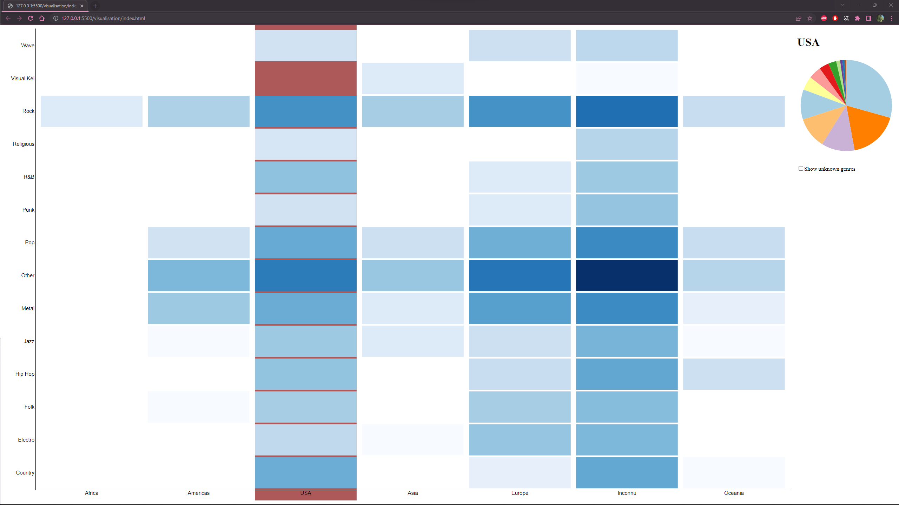
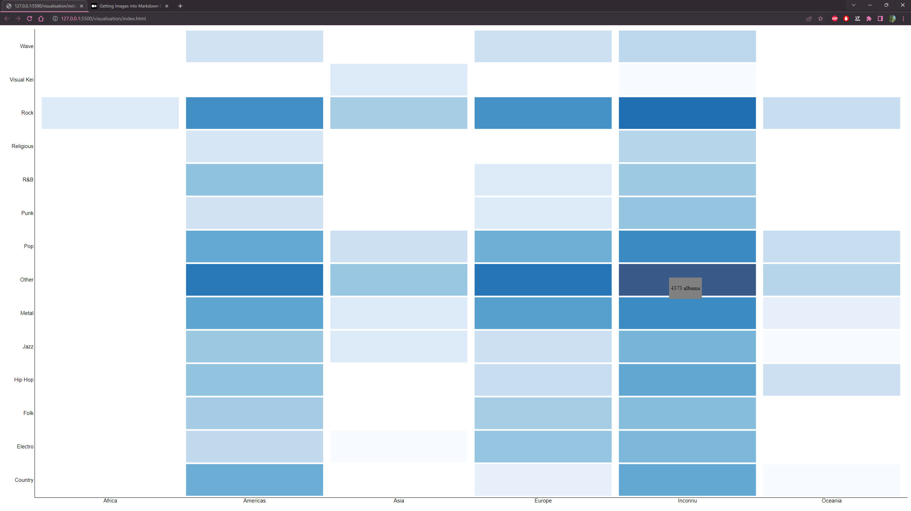
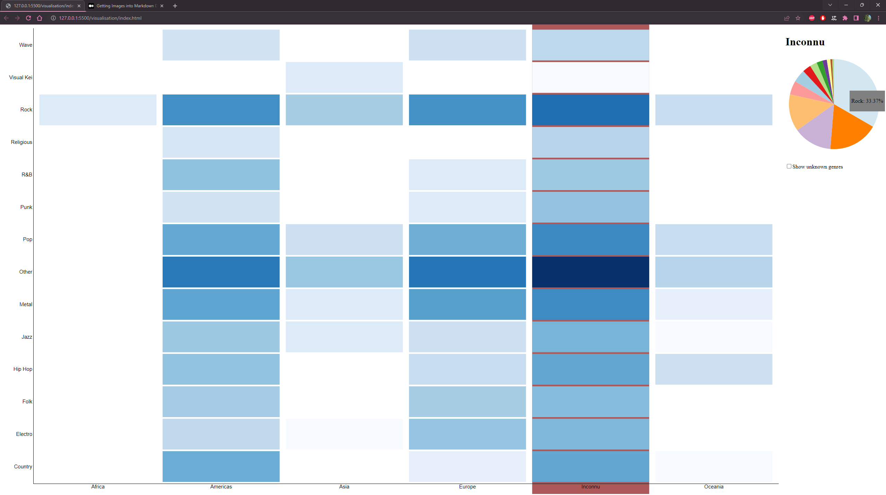
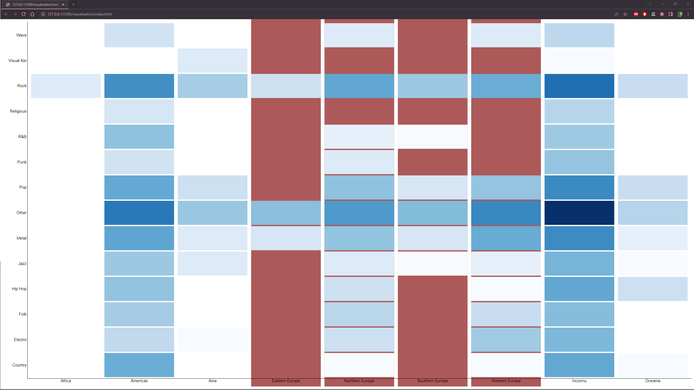

# Data visualisation

Go to visualisation : https://yannclodong.github.io/DataVisualisation/visualisation/

Le but de ce projet est de visualiser la popularité des genre entre les pays.
Mon partenaire, lui, prend en compte les années. Le traitement de données prendra donc ces 2 aspects en compte.

## Summary
1. Personnas
2. Scénarios
3. Technique de visualisation
4. Traitement des données

## Personnas
1. Franck Michel
    - 35 ans
    - chercheur au CNRS
    - Il est responsable de la base de données WASABI : base de données utilisé pour notre future visualisation.
    - Il veut pouvoir améliorer sa base de données en recherchant des attributs manquant, faute de frappe, etc...

2. Antoine Curieux
    - 25 ans
    - Amateur de musique
    - Curieux de connaitre la popularité des genres entre les différent pays
3. Philippe Faitdubuzz
    - 40 ams
    - Impressario
    - Cherche à faire connaître son artiste.

## Scénarios
1. Comptabiliser les albums dont on ne connait pas le genre ou le pays d'édition. 
Pour __Franck Michel__, cela peut lui permettre de voir ou s'investir pour améliorer sa base de données.
2. Connaître quel genre est le plus populaire dans tel ou tel pays. 
Pour __Philippe Faitdubuzz__, cela peut être utilie pour influencer sont artiste pour lui conseiller un genre plus populaire. 
Pour __Antoine Curieux__, cela peut lui permettre de connaitre quel genre est populaire et voir les différence de goût entre les pays.
3. Connaitre quel est le pays ou le genre est le plus populaire. 
Pour __Philippe Faitdubuzz__, cela peut être utilie pour choisir dans quel pays sortir ses albums. 
Pour __Philippe Faitdubuzz__, cela peut être utilie pour faire faire des tourné à son artiste et gagner en popularité. 
Pour __Antoine Curieux__, cela peut lui permettre de connaitre quel genre est populaire et voir les différence de goût entre les pays.
4. Connaitre la proportion d'un genre dans un pays. 
Pour __Franck Michel__, cela peut lui permettre de voir si les données ne sont pas trops incomplète.

## Technique de visualisation
### Choix de la technique de visualisation
Pour choisir la technique de visualisation, 3 critères sont à prendre en compte :
- Les dimensions, nous avons des données 3 dimensions, en effet, nous avons les genres, les pays et le nomre d'albums
- Le type de dimension, deux d'entre elles sont catégorielles et une est quantitative
- Le but, Et enfin nous voulons une technique de visualisation qui nous permettra de comparer les valeurs.

La solution la plus pertinante est alors une __Heatmap__. 

Pour le scénario 4, nous aurons besoin d'une autre technique de visualisation, en effet les données sont affiché quantitativement, il faudra donc une nouvelle vue pour affiché ces données proportionnellement. La solution la plus pertinante est alors un __diagramme circulaire__.

### Données affiché
Pour rendre les données plus compréhensible, nous allons les affiché de la manière suivante : 
- Dans la heatmap lors du survol d'une case, nous affichons le nombre d'albums.

- Dans le diagramme circulaire, nous affichons la proportion de chaque genre ainsi que le genre survolé.

Dans le panel affichant les proportions de chaque genre, nous proposerons une case à cocher pour afficher les genre "Inconnu" qui sera décoché par défaut.

### Gestion de l'importance du Dataset
Le dataset contient un important nombre de genre comme de pays, ceci bien que finis, auront du mal à être affiché correctement. Pour cela, nous allons utiliser une vue __arborescente__ des axes. 

En effet, pour les genre, les genres seront regroupé par famille, par exemple "Alternative Rock" est un "Rock". 
Pour les pays, les pays seront regroupé par region puis par continent, par exemple "France" est en "Europe de l'Ouest" qui est en "Europe". 

Lorsque l'on cliquera sur les label des axes, nous naviguerons dans l'arborescence.

Etant données la taille de certaines valeurs dans la heatmap, nous avons fait le choix d'afficher les couleurs dans une échelle logarithmique en base 10 qui nous permet d'avoir une meilleur répartition des couleurs.

## Traitement des données
### Données importantes
Les données utililes sont donc :
- Le genre
- Le pays
- Le nombre d'albums
- et l'année (pour mon partenaire)

### Traitement
1. Nous extrairons donc d'abords ces données de la base de données WASABI. 
2. Ensuite, nous allons regrouper les données par genre et par pays, puis compter le nombre d'albums par genre et par pays. 
3. Le pays est représenté par son code à 2 caractères dans la base de données WASABI, nous allons donc le remplacer par son nom complet issue d'un autre dataset. 
4. Finalement, nous l'exporterons dans un fichier CSV qui pourra être lu par la visualisation.
